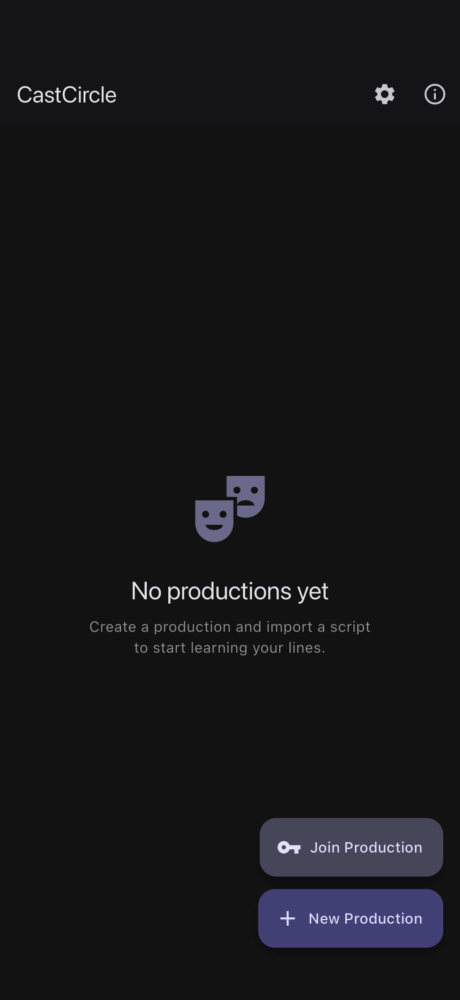
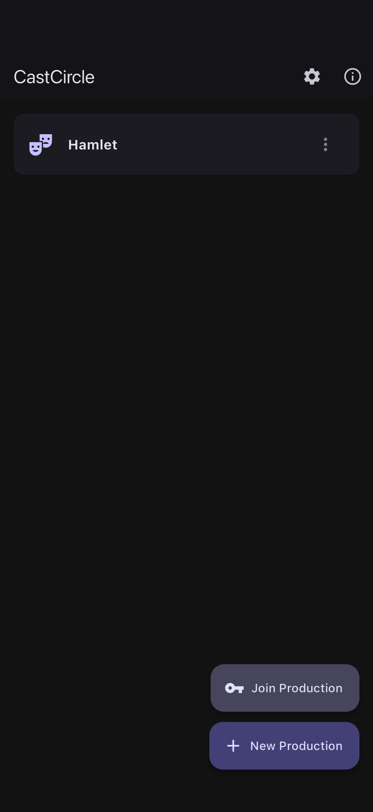
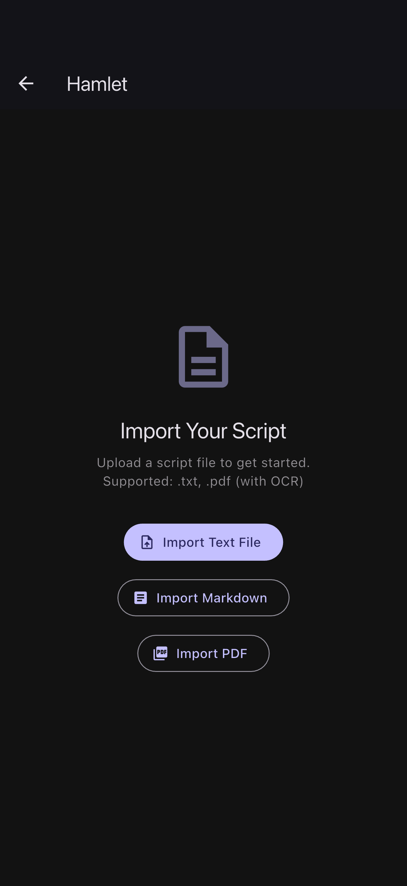
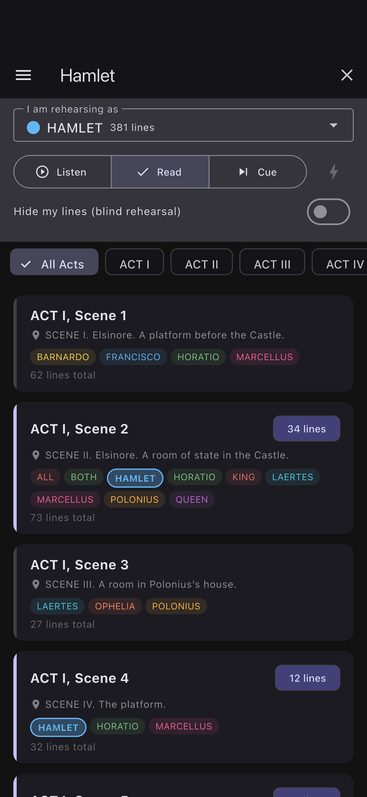
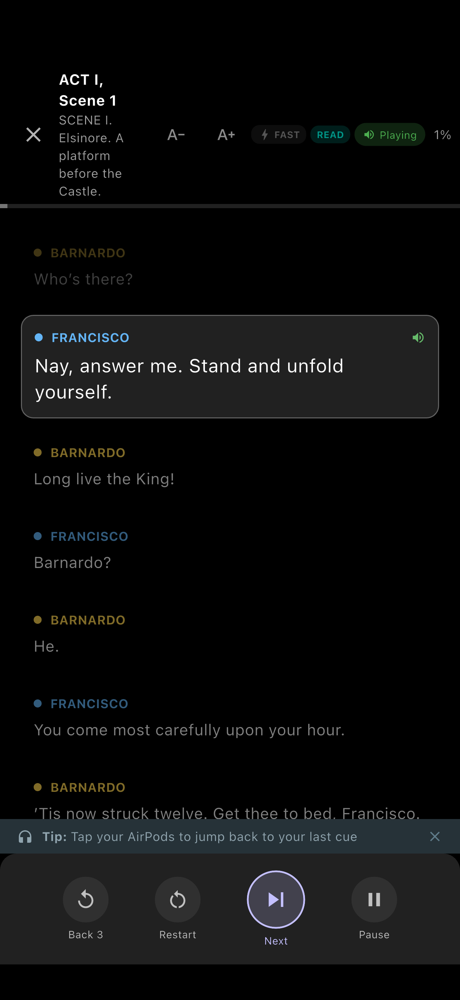
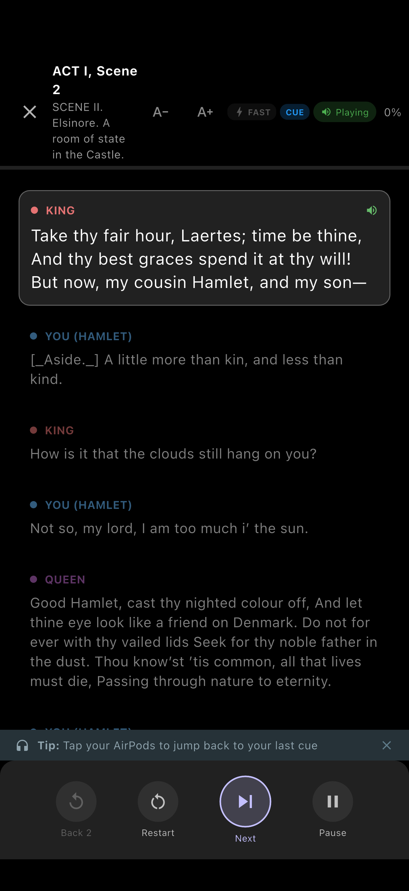
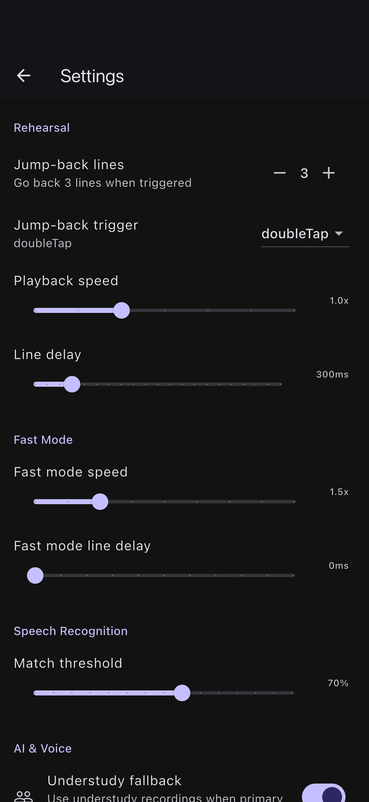
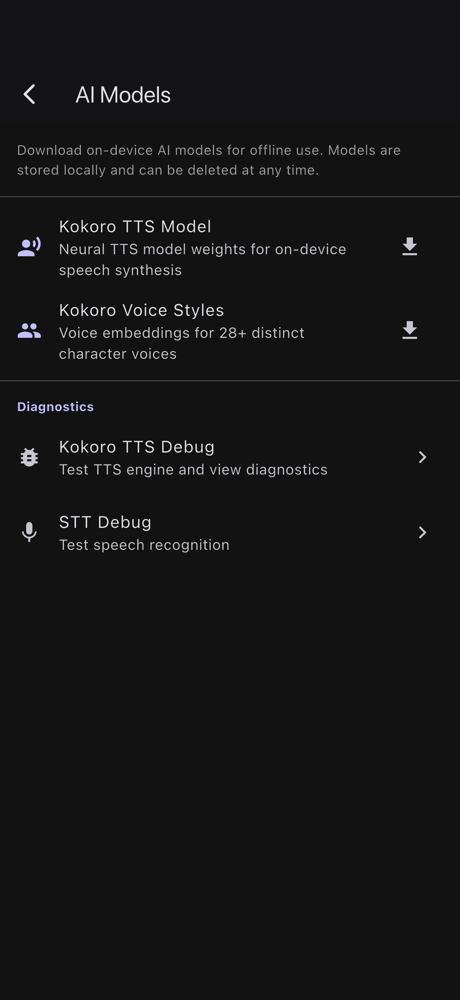
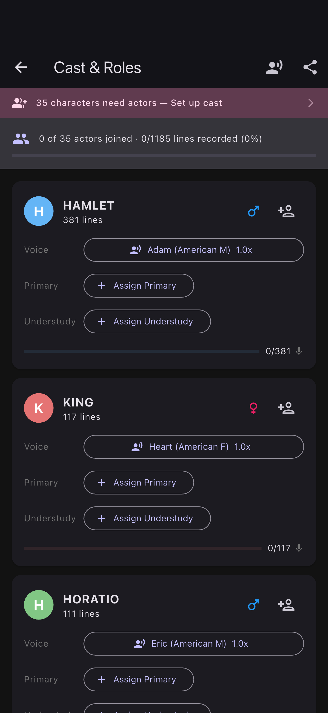

# CastCircle — Learn Your Lines

**The actor's scene partner in your pocket.**

CastCircle is a Flutter app that helps actors learn their lines by running through scenes with on-device AI voices or real cast recordings. Import a script (PDF or text), pick your character, and rehearse — the app reads other characters' lines aloud and listens as you deliver yours, advancing automatically when you get them right.

---

## Screenshots

<table>
  <tr>
    <td align="center">
      <br>
      <sub><b>Home</b> — empty state</sub>
    </td>
    <td align="center">
      <br>
      <sub><b>Home</b> — with a production</sub>
    </td>
    <td align="center">
      <br>
      <sub><b>Import</b> — txt, markdown, or PDF</sub>
    </td>
  </tr>
  <tr>
    <td align="center">
      <br>
      <sub><b>Production hub</b> — scene picker</sub>
    </td>
    <td align="center">
      <br>
      <sub><b>Rehearsal</b> — readthrough mode</sub>
    </td>
    <td align="center">
      <br>
      <sub><b>Rehearsal</b> — actor mode</sub>
    </td>
  </tr>
  <tr>
    <td align="center">
      <br>
      <sub><b>Settings</b> — jump-back, speed, STT</sub>
    </td>
    <td align="center">
      <br>
      <sub><b>AI Models</b> — Kokoro TTS</sub>
    </td>
    <td align="center">
      <br>
      <sub><b>Cast</b> — roles & voice assignment</sub>
    </td>
  </tr>
</table>

<sub>Generated from a real Hamlet import (35 characters, 5 acts, 20 scenes, 1,185 lines) on iPhone 16 Pro Max — see `scripts/generate_screenshots.sh`.</sub>

---

## How It Works

### 1. Import a Script
Upload a PDF or paste text. The app uses on-device OCR (Google ML Kit) to extract text from PDFs, then parses it into structured dialogue. Three script formats are auto-detected:

- **Standard** — `CHARACTER. Dialogue on the same line`
- **Name-on-own-line** — Character name alone on one line, dialogue on the next (Gutenberg format)
- **Title-case** — `Name. dialogue` (First Folio Shakespeare style)

The parser handles OCR error correction, dehyphenation, Gutenberg preamble/postamble stripping, inline stage directions, and automatic scene boundary detection.

### 2. Set Up Characters & Voices
The app extracts a cast list from the script and infers gender from title prefixes ("MR.", "LADY"), a name database, and pronoun context in stage directions. Each character is mapped to a Kokoro MLX voice with appropriate gender and accent. You can reassign voices, adjust per-character speech rate, and switch between American and British English dialects.

### 3. Rehearse
Pick a scene and the character you're playing:

- **Other characters' lines** play back via on-device TTS (Kokoro MLX), with fallback to real cast recordings or system TTS
- **Your lines** — the app listens via Apple Speech Recognition with vocabulary hints (character names, expected words) for better accuracy
- The app matches what you say against the expected line and **advances automatically**
- **Jump back** to retry a section
- **Pause/resume** at any time
- Session analytics track line attempts, match scores, and completion rate

### 4. Record Lines (Multi-User)
For group productions: cast members record their lines one at a time, synced via Supabase cloud storage. During rehearsal, real recordings take priority over TTS for a more natural experience.

---

## Tech Stack

| Layer | Technology |
|-------|-----------|
| Framework | Flutter (iOS primary, Android planned) |
| State Management | Riverpod 2.x with code generation |
| Local DB | Drift (SQLite) with typed queries |
| Models | Freezed (immutable data classes) |
| TTS | Kokoro via MLX (on-device neural synthesis, 16 voices) |
| STT | Apple SFSpeechRecognizer (real-time streaming with vocabulary hints) |
| OCR | google_mlkit_text_recognition |
| Audio Playback | just_audio |
| Audio Recording | record |
| Cloud (optional) | Supabase (Auth, Postgres, Storage) |
| Navigation | go_router |

---

## Project Structure

```
lib/
├── main.dart                          # Entry point, DI setup
├── app.dart                           # Router, theme, navigation shell
├── data/
│   ├── database/                      # Drift ORM schema & migrations
│   ├── models/                        # Freezed models
│   └── services/
│       ├── script_parser.dart         # Script parsing (3 formats, OCR cleanup)
│       ├── tts_service.dart           # Kokoro MLX + system TTS fallback
│       ├── stt_service.dart           # Apple STT with vocabulary hints
│       ├── stt_vocabulary_service.dart # Contextual vocabulary generation
│       ├── voice_config_service.dart   # Character → voice mapping
│       ├── supabase_service.dart       # Cloud sync & auth
│       └── debug_log_service.dart      # Debug UI + native memory logging
├── features/
│   ├── home/                          # Production list
│   ├── script_import/                 # PDF/text upload & preview
│   ├── script_editor/                 # Character/scene editor, validation
│   ├── production_hub/                # Main hub (rehearsal-first UX)
│   ├── rehearsal/                     # Scene selector, rehearsal engine
│   ├── cast_manager/                  # Role assignment
│   ├── recording_studio/             # Line-by-line recording
│   └── settings/                      # Preferences, model management
└── providers/                         # Riverpod providers
```

---

## Script Parser

The parser (`lib/data/services/script_parser.dart`) is the most complex piece. Key capabilities:

- **Auto-format detection** — counts pattern matches to pick the right parser
- **OCR error correction** — fuzzy matching (edit distance), garbage detection, title variant normalization
- **Shakespeare support** — abbreviation resolution (HAM→HAMLET), full names from Enter/Exit stage directions
- **Scene detection** — explicit markers ("SCENE 1", "Scena Secunda"), location patterns, entrance/exit clusters
- **Gender inference** — title prefixes, name database, pronoun context in stage directions

---

## Rehearsal Engine

The rehearsal screen (`lib/features/rehearsal/rehearsal_screen.dart`) runs a state machine:

```
ready → playingOther → listeningForMe → paused → sceneComplete
```

**Audio fallback chain** for other characters' lines:
1. Real cast recording (primary actor)
2. Understudy recording
3. Kokoro MLX TTS (preferred AI fallback)
4. System TTS (last resort)

**STT** uses Apple SFSpeechRecognizer with contextual vocabulary hints — character names, stage terms, and words from the expected line — to improve recognition accuracy on theatrical dialogue.

---

## Getting Started

```bash
# Prerequisites: Flutter SDK, Xcode
git clone https://github.com/jasontitus/CastCircle.git
cd CastCircle
flutter pub get
flutter run
```

Kokoro TTS models (~340 MB) download on first use via the Settings screen.

---

## License

TBD
